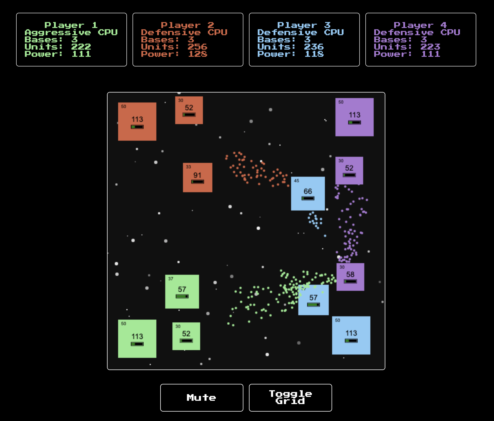

# [Commander](https://scott-n-ha.github.io/Commander/)
A Real-Time Strategy game by Scott Ha



## Objective
The main objective of the game is to command your units to "conquer" the bases on the board. There are other AI players that are also trying to do the same.

## Designing multiple AI
One of the hardest challenges for this project was deisgning multiple versions of AI that would play differently so that the gameplay would not be stale.

Here is an example of the `Sneaky CPU` that I built. Its main goal is to target the weakest base of the strongest player on the board and "swarm" the base with its units.

```javascript
sneakyManuevers() {
    // Find the player with the most favorable bases
    const mostBases = this.game.players.reduce((acc, player) => {
      if (acc === this) return player;
      if (player === this) return acc;
      if (acc.bases.length > player.bases.length) return acc;
      if (acc.bases.length === player.bases.length && acc.unitCount < player.unitCount) return acc;
      return player;
    });

    // Target the weakest base
    this.swarmWeakestBase(mostBases);
  }
```

By using Array.reduce, I was able to quickly sort through the entire game's board state in one iteration as well as filter down to the most desirable base that the CPU would choose. Once the base was found, I simply called a shared method `swarmWeakestBase` that would allow a "player", in this case our CPU, to "swarm" that base with their units.

## Cloning the Repository and Running on a Local Machine
* Run `git clone https://github.com/Scott-N-Ha/Commander.git`
* Run `npm install` in the root folder
* Run `npm start` to start the webpack
* Navigate to the `index.html` file location in a browser to run the game
